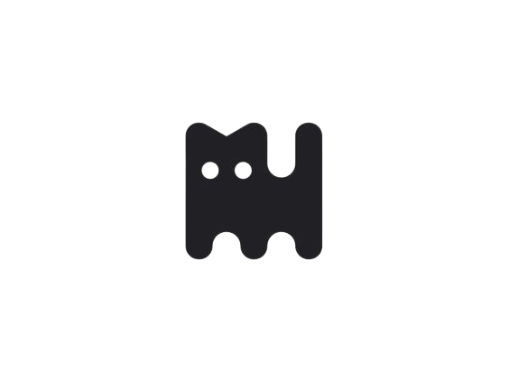

<a name="readme-top">

<br/>

<br />
<div align="center">
  <a href="https://github.com/zyx-0314/">
    
  </a>
  <h3 align="center">Seatwork 3: Footer & Header</h3>
</div>
<div align="center">
  This is for demonstrating skills in HTML and CSS with Multiple Pages, Effects and Container Manipulations. Providing a Different Versions of Headers and Footers.
</div>

<br />


---

<br />
<br />

<details>
  <summary>Table of Contents</summary>
  <ol>
    <li>
      <a href="#overview">Overview</a>
      <ol>
        <li>
          <a href="#key-components">Key Components</a>
        </li>
        <li>
          <a href="#technology">Technology</a>
        </li>
      </ol>
    </li>
    <li>
      <a href="#rule,-practices-and-principles">Rules, Practices and Principles</a>
    </li>
    <li>
      <a href="#resources">Resources</a>
    </li>
  </ol>
</details>

---

## Overview

This is a project coding of HTMl and CSS of different kinds of headers and footers in addition of animations. This is to have hands-on experience in coding and having an actual output tasked to us by our Instructor. In addition, a lot of my designs are more on animation of moving objects and button hover effect.

### Key Components
- Header Animation
  - Hover Effect
  - Active Effect
  - Moving Animation
  - Circulating Effect
  - Hover Effect on Background

- Footer Aniamtion
  - Moving Animation
  - Icon Hover


### Technology


## Rules, Practices and Principles
1. Always use `WD-` in the front of the Title of the Project for the Subject followed by your custom naming.
2. Do not rename any .html files; always use `index.html` as the filename.
3. Place Files in their respective folders.
4. All file naming are in camel case.
   - Camel case is naming format where there is no white space in separation of each words, the first word is in all lower case while the succeding words first letter are in upper followed by lower cased letters.
   - ex.: buttonAnimatedStyle.css
5. Use only `External CSS`.
6. Renaming of Pages folder names are a must, and relates to what it is doing or data it holding.
7. File Structure to follow below.

```
WD-ProjectName
└─ assets
|   └─ css
|   |   └─ style.css
|   └─ img
|   |   └─ fileWith.jpeg/.jpg/.webp/.png
|   └─ js
|       └─ script.js
└─ pages
|  └─ pageName
|     └─ assets
|     |  └─ css
|     |  |  └─ style.css
|     |  └─ img
|     |  |  └─ fileWith.jpeg/.jpg/.webp/.png
|     |  └─ js
|     |     └─ script.js
|     └─ index.html
└─ index.html
└─ readme.md
```

## Resources

| Title | Purpose | Link |
|-|-|-|
| Responsive Footer | Got the design for the footer | https://codepen.io/matheusalmeida/pen/aeLMMr |
| Header Design | BUtton inspiration | https://codepen.io/cbolson/pen/OJGKdNJ |
| header mag  | Got the design for the header | https://codepen.io/samiralley/pen/nxeKeq |
| Landing Page | the idea and design animation for the landing page | https://codepen.io/nahrowi/pen/GjwYEz |
| hamburger menu | Header design | https://codepen.io/jasperlachance/pen/yOJdRr |
| Sibling select | Idea for the header background | https://codepen.io/giana/pen/dWJzMK |
